# EscultorPaint

Ferramenta para esculpir figuras 3D 

## Como usar

### Criar uma nova escultura

Primeiro clique neste butão

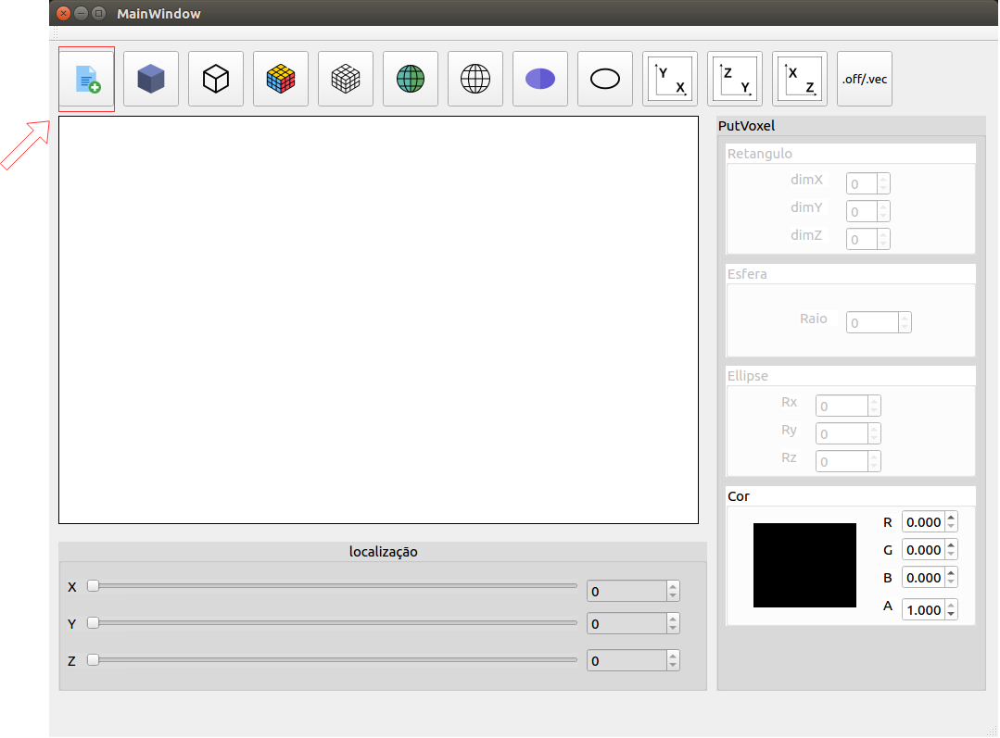

depois digite as dimensões do volume 3D (nx, ny, nz) no qual a escultura vai ser feita

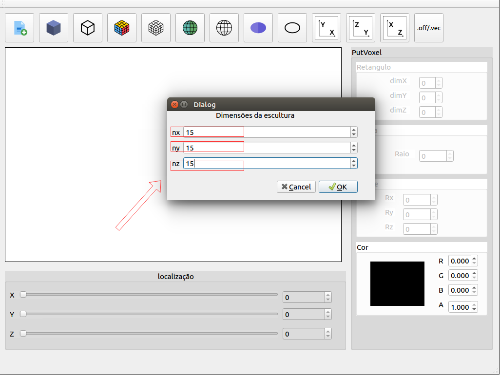

### Escolhendo a cor do voxels que irão ser pintados

Utiliza as spin boxes R, G, B e A, para selecionar uma cor para pintar os voxels

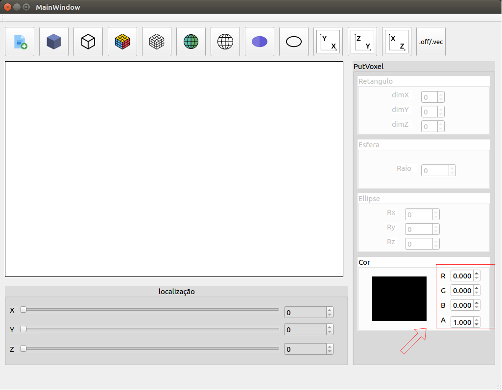

### Navegando no eixo não visivel

Dependendo do modo de visualização do plano (XY, YZ, ZX), você pode naevgar no eixo não visivel (Z, X, Y)

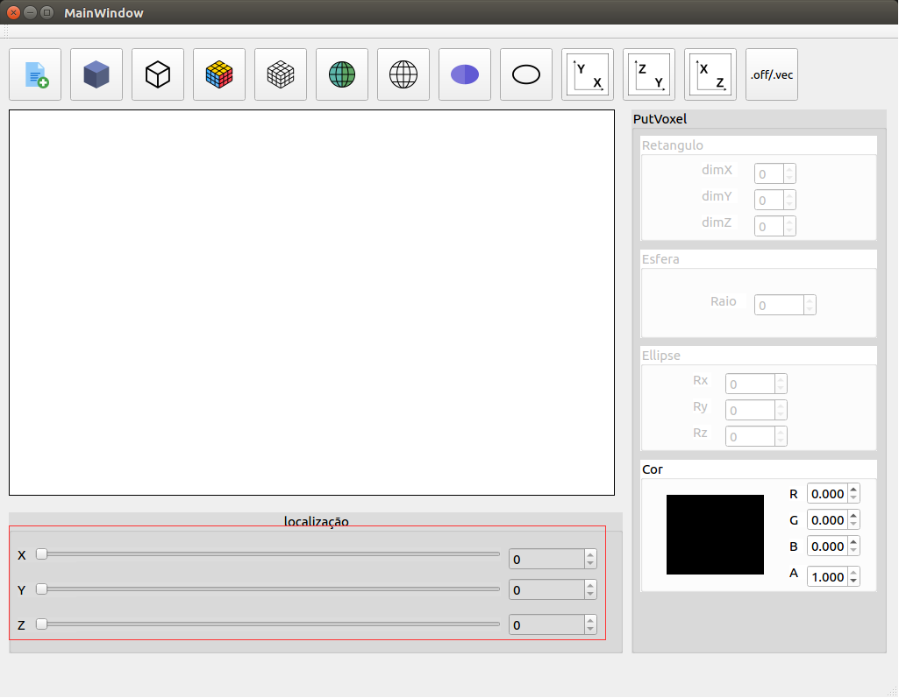

### Pintando um voxel

Para pintar um voxel você precisa:

1. Pressionar o botao "pintar voxel"
2. Perceba que o nome da ação atual foi atualizada
3. Clique em algum quadrado do grid

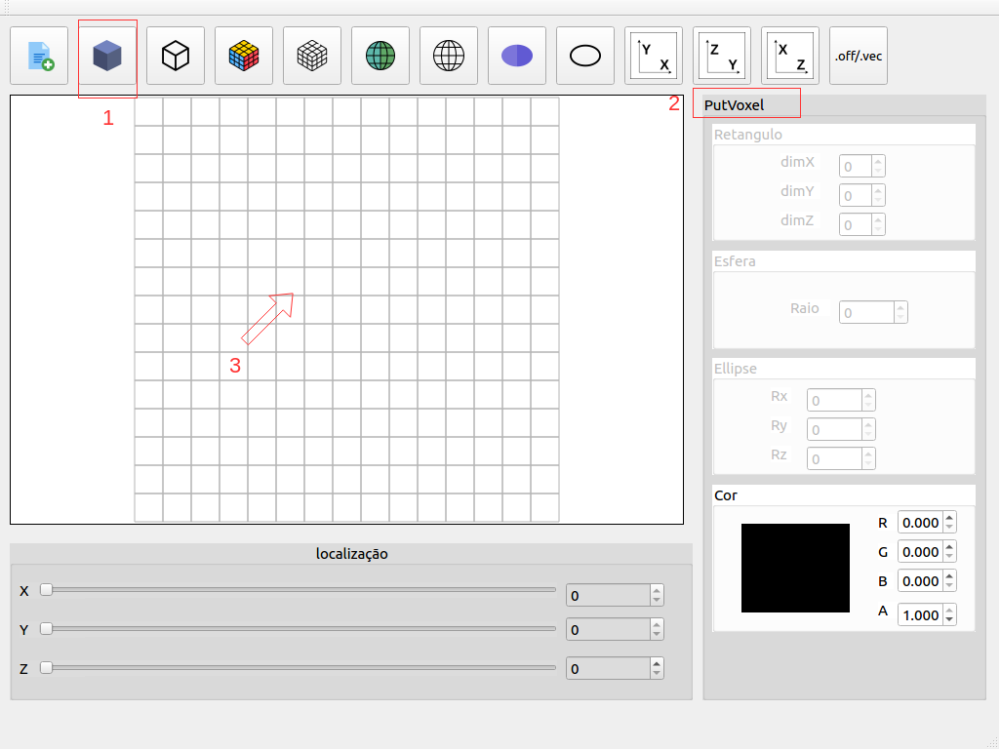

### Removendo um voxel

Para remover um voxel você precisa:

1. Pressionar o botao "remover voxel"
2. Perceba que o nome da ação atual foi atualizada
3. Clique em algum quadrado pintando do grid

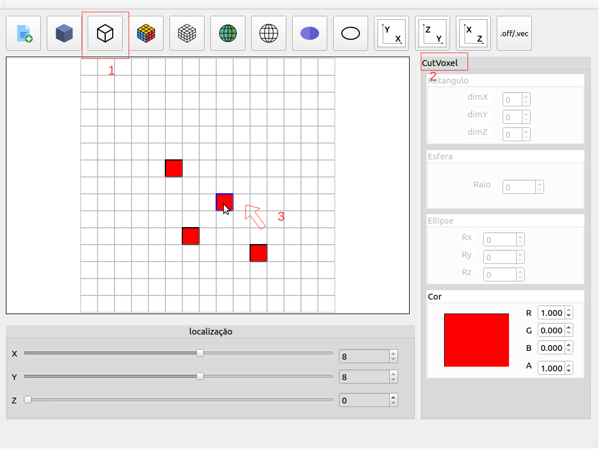

### Pintando um retangulo 3D

Para pintar um retangulo 3D você precisa:

1. Pressionar o botao "pintar cubo"
2. Perceba que o nome da ação atual foi atualizada
3. Especifice o número de unidades (voxels) para expandir em torno do quadrado clicado
4. Clique em algum quadrado do grid

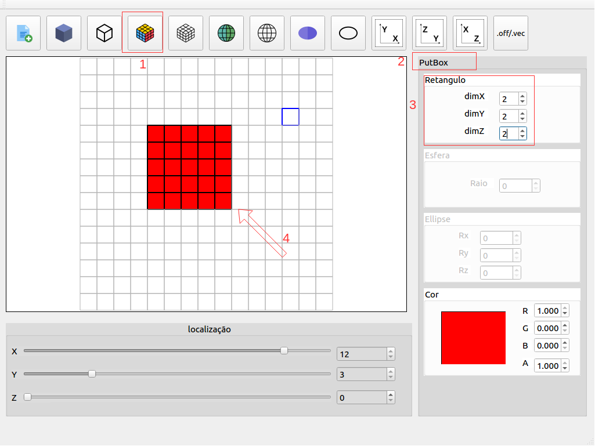

### Removendo um retangulo 3D

Para remover um retangulo 3D você precisa:

1. Pressionar o botao "remover cubo"
2. Perceba que o nome da ação atual foi atualizada
3. Especifice o número de unidades (voxels) para remover em torno do quadrado clicado
4. Clique em algum quadrado do grid

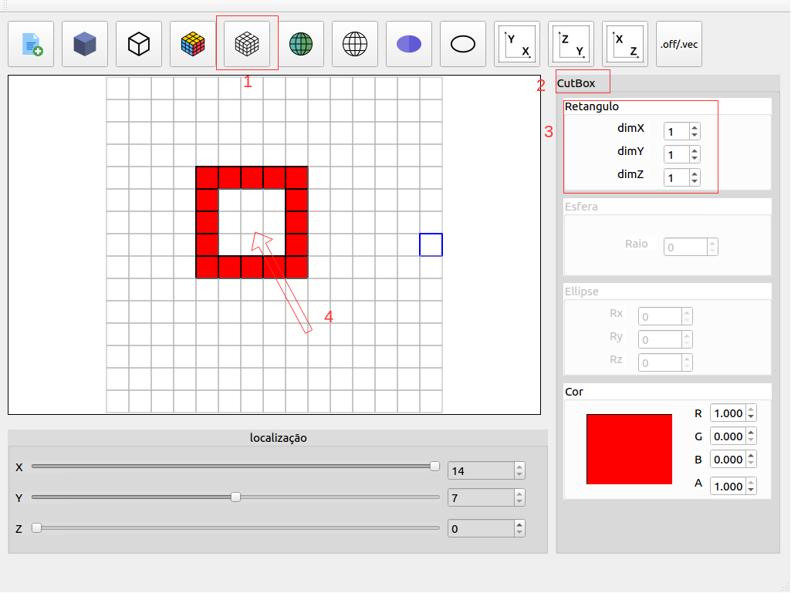

### Pintando uma esfera

Para pintar uma esfera você precisa:

1. Pressionar o botao "pintar esfera"
2. Perceba que o nome da ação atual foi atualizada
3. Especifice o raio da esfera
4. Clique em algum quadrado do grid

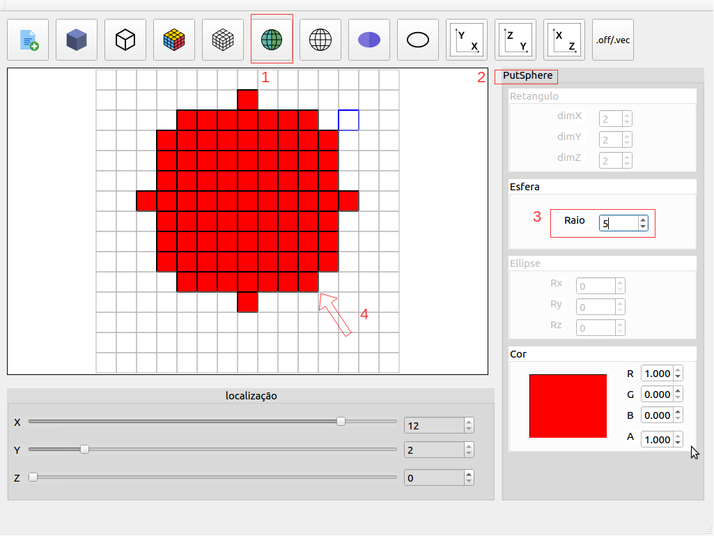

### Removendo uma esfera

Para remover uma esfera você precisa:

1. Pressionar o botao "remover esfera"
2. Perceba que o nome da ação atual foi atualizada
3. Especifice o raio da esfera
4. Clique em algum quadrado do grid

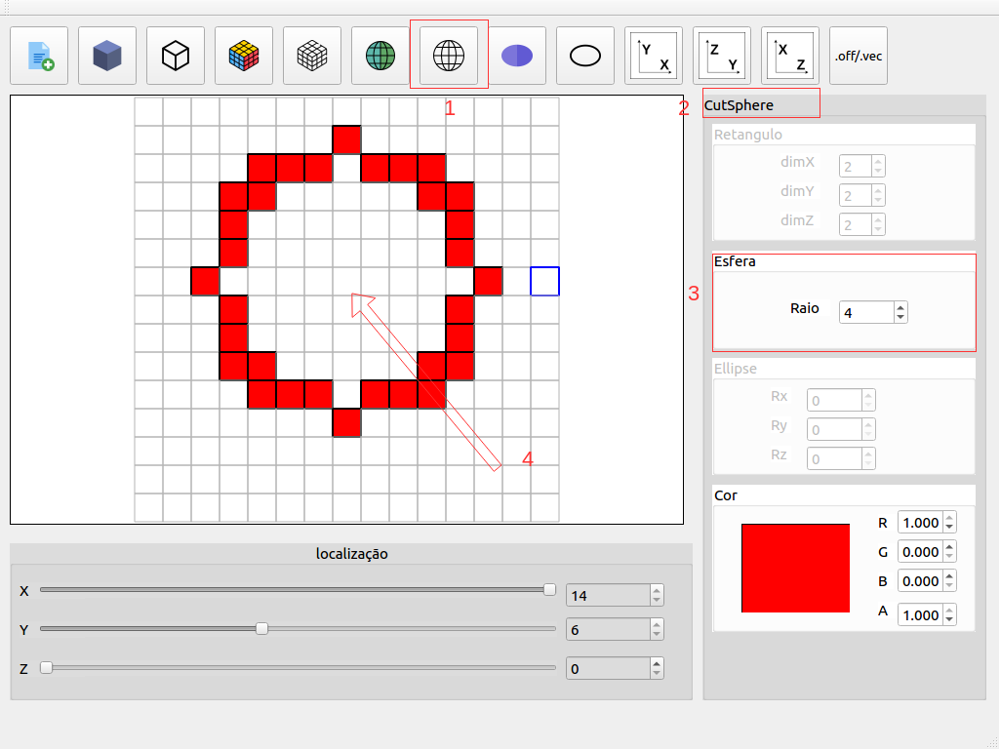

### Pintando uma ellipsoide

Para pintar uma ellipsoide você precisa:

1. Pressionar o botao "pintar ellipsoid"
2. Perceba que o nome da ação atual foi atualizada
3. Especifice o raios do ellipsoid (Rx, Ry, Rz)
4. Clique em algum quadrado do grid

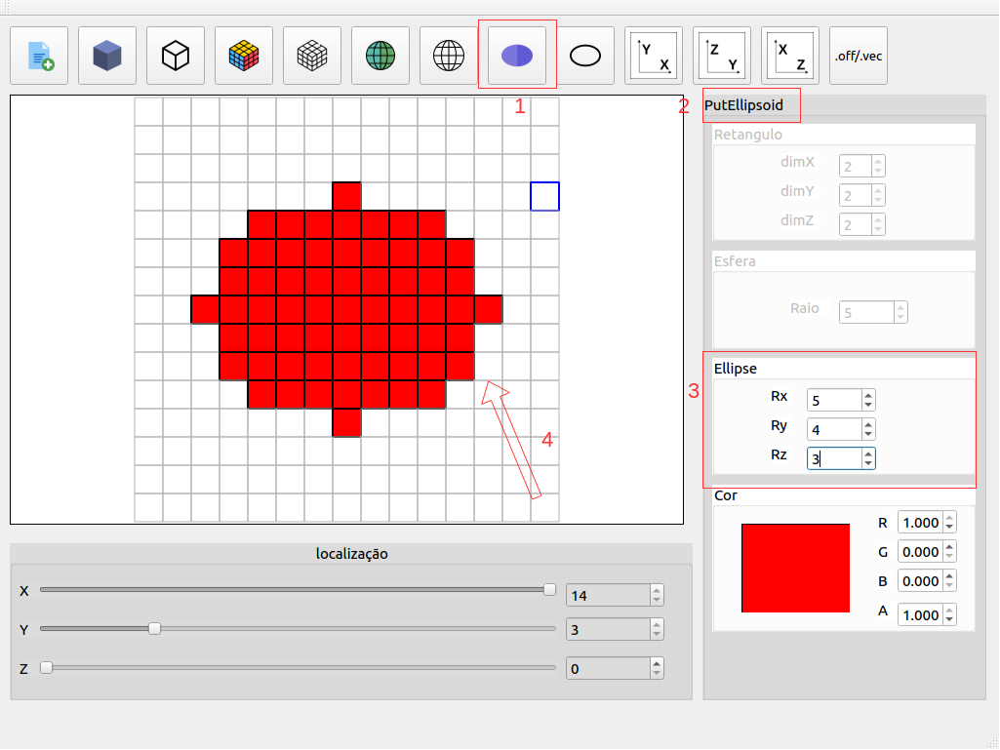

### Removendo uma ellipsoide

Para remover uma ellipsoide você precisa:

1. Pressionar o botao "remover ellipsoid"
2. Perceba que o nome da ação atual foi atualizada
3. Especifice o raios do ellipsoid (Rx, Ry, Rz)
4. Clique em algum quadrado do grid

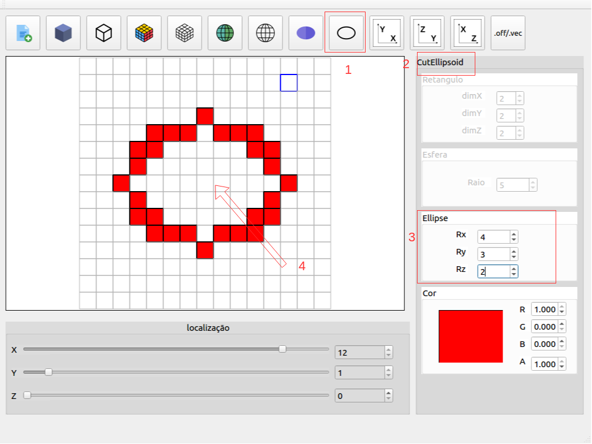

### Escolhendo o plano de visualiação

#### plano XY

#### plano YZ

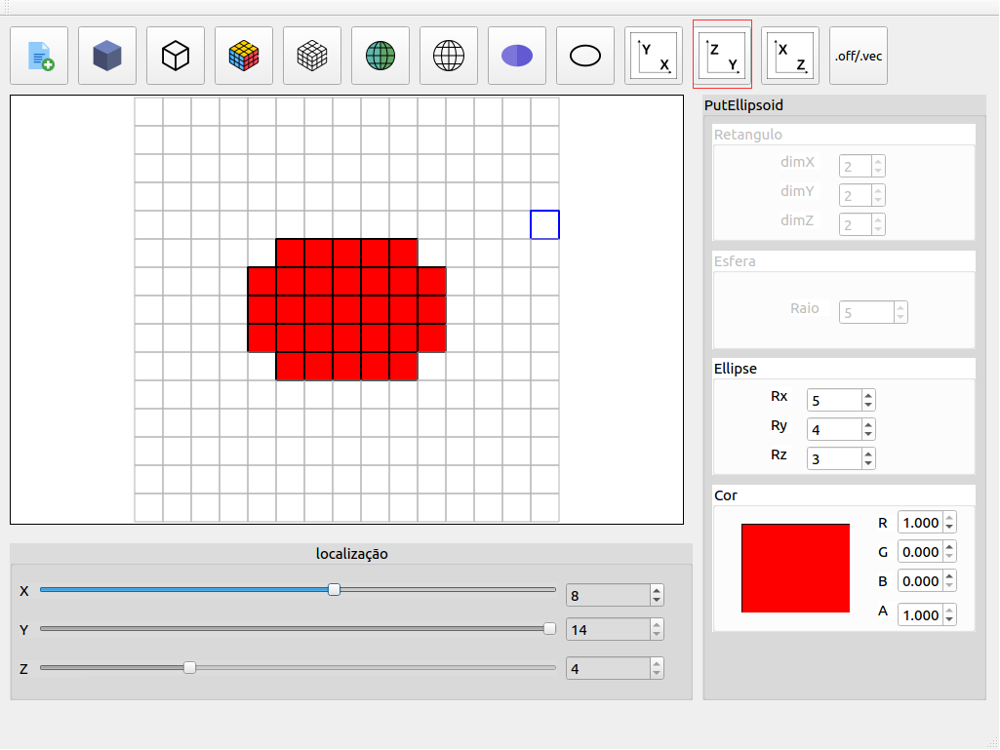

#### plano ZX

### Salvando a escultura (.off/.vec)

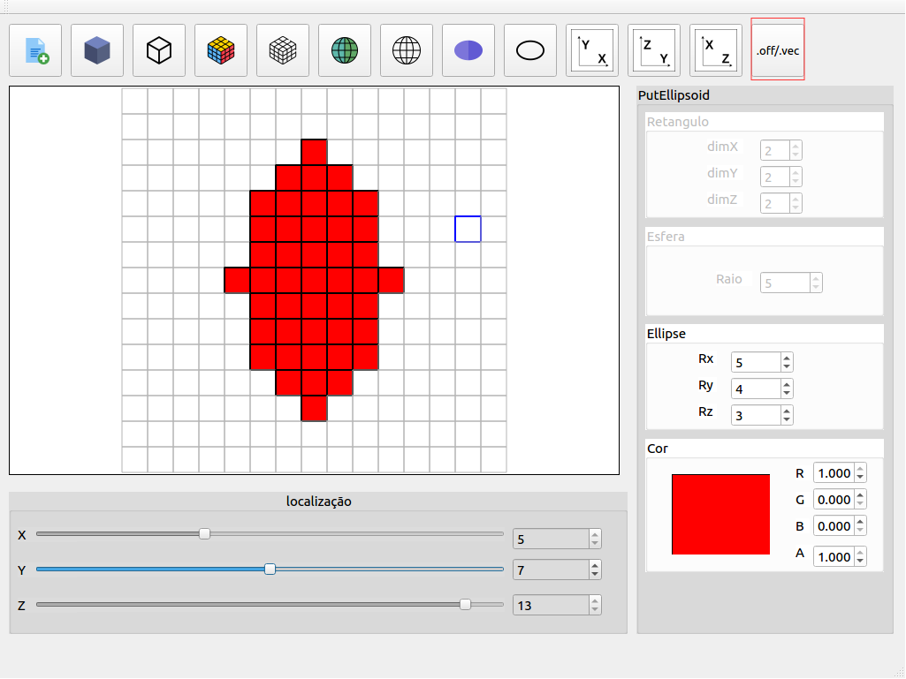
